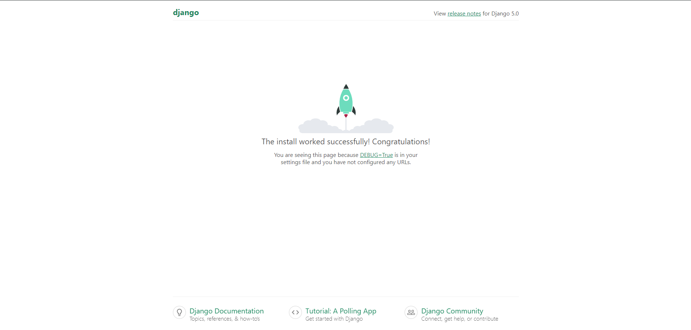

# 🤓 Manual para Empezar en Django

>Creado por: Rodrigo Hernández para la conferencia de Frontend con Django

<div align="center"></div>


Acaso tu eres estudiante, ya viste mucho de python, te interesa el desarrollo web y quieres empezar a trabajar con Django, este manual es para ti. Aquí te dejo los pasos para que puedas empezar a trabajar con Django.

## Instalación de Librerias

Primero que nada necesitas tener instalado Python en tu computadora, si no lo tienes puedes descargarlo desde la página oficial de [Python](https://www.python.org/). 

Posteriormente necesitas instalar Django, para ello puedes hacerlo con el siguiente comando:

```bash
pip install django
```

Además de Django, necesitas instalar la librería de requests para realizar peticiones a tu Backend, para ello puedes hacerlo con el siguiente comando:

```bash
pip install requests
```

## Crear un Proyecto en Django

Para crear un proyecto en Django, necesitas ejecutar el siguiente comando:

```bash
django-admin startproject << nombre_proyecto >>
```

Donde `<< nombre_proyecto >>` es el nombre que le quieres dar a tu proyecto.

Luego entra a la carpeta del proyecto con el siguiente comando:

```bash
cd << nombre_proyecto >>
```

Si quieres probar que tu proyecto se ejecuta correctamente, puedes ejecutar el siguiente comando:

```bash
py manage.py runserver
```

Luego entra al navegador y escribe la siguiente dirección:

```
http://localhost:8000
```

Si ves la siguiente pantalla, tu proyecto se ha creado correctamente:



Ahora apaga el servidor con `Ctrl + C`, porque procederemos a configurar nuestro proyecto.

## Crear una Aplicación en Django

Ubicate en la carpeta de tu proyecto, ejecuta el siguiente comando para crear una aplicación:

```bash
py manage.py startapp << nombre_app >>
```

Donde `<< nombre_app >>` es el nombre que le quieres dar a tu aplicación.

Luego ve a la carpeta de tu proyecto y abre el archivo `settings.py`, en la lista de `INSTALLED_APPS` y revisa que tenga el `django.contrib.staticfiles` y sino lo tiene agregalo.:

```python
INSTALLED_APPS = [
    'django.contrib.admin',
    'django.contrib.auth',
    'django.contrib.contenttypes',
    'django.contrib.sessions',
    'django.contrib.messages',
    'django.contrib.staticfiles',
]
```

Luego verifica en el mismo archivo de `settings.py` que tengas lo siguiente:

```python
STATIC_URL = 'static/'
```

Entonces ve a la carpeta de tu aplicación (`<<nombre_aplicación>>`) y agregale una carpeta llamada `static` y dentro de esta carpeta le pueden agregar imagenes, css, js, etc.

Posteriormente ve a la carpeta de tu aplicación (`<<nombre_aplicación>>`) y agregale una carpeta llamada `templates` y dentro de esta carpeta le pueden agregar los archivos html.


### Agregamos nuestra aplicación al proyecto

Para agregar la aplicación al proyecto necesitas ir a `<<nombre_aplicacion>>/apps.py` y copiar el nombre de la clase:

```python
from django.apps import AppConfig


class AppConfig(AppConfig):
    default_auto_field = 'django.db.models.BigAutoField'
    name = 'app'
```
En este caso el nombre de la clase es `AppConfig` y ese nombre es el que tienes que copiar.

Luego ve a la carpeta de tu proyecto y abre el archivo `settings.py`, en la lista de `INSTALLED_APPS` agrega el nombre de la clase que copiaste:

- Lo que tienes que agregar es:
    ```python
    '<<nombre_aplicacion>>.apps.<<nombre_clase>>',
    ```

- Entonces quedaría algo así:
    ```python
    INSTALLED_APPS = [
        'app.apps.AppConfig',
        'django.contrib.admin',
        'django.contrib.auth',
        'django.contrib.contenttypes',
        'django.contrib.sessions',
        'django.contrib.messages',
        'django.contrib.staticfiles',
    ]
    ```

## Configurar nuestras propias URLs

Primero vamos a la carpeta de la aplicación y creamos un archivo llamado `urls.py`, en este archivo vamos a agregar las rutas de nuestra aplicación.

Luego dentro de este archivo vamos a agregar lo siguiente:

```python
from django.urls import path
from . import views
```

Luego vamos a crear nuestras vistas, para ello ve al archivo `views.py` y agrega lo siguiente:

```python
from django.shortcuts import render
import requests

# Create your views here.

#Esta es una vista de ejemplo, pero puedes agregar las que necesites
def index(request):
    return render(request, 'index.html')
```

El archivo que menciona de `index.html` es un archivo que debes crear en la carpeta `templates` de tu aplicación.

Entonces creado el archivo `index.html` en la carpeta `templates` de tu aplicación, puedes agregar el siguiente código:

```html
<!DOCTYPE html>
<html lang="en">
<head>
    <meta charset="UTF-8">
    <meta http-equiv="X-UA-Compatible" content="IE=edge">
    <meta name="viewport" content="width=device-width, initial-scale=1.0">
    <title>Ejemplo Django</title>
</head>
<body>
    <h1>Hola Mundo</h1>
</body>
</html>
```

Luego volvemos al archivo `urls.py` de nuestra aplicación y agregamos las rutas de nuestra aplicación:

```python
urlpatterns = [
    path('', views.index, name='index'),
]
```

Ahora vamos a la carpeta de nuestro proyecto y abrimos el archivo `urls.py`, en este archivo vamos a agregar las rutas de nuestra aplicación:

```python
#Importamos de django.urls la función include
from django.urls import path, include

#Comentamos la línea de admin y agregamos la línea de include para agregar las rutas de nuestra aplicación
urlpatterns = [
    #path('admin/', admin.site.urls),
    path('', include('<<nombre_aplicacion>>.urls')),
]
```

Ahora ya puedes intentar correr tu servidor con el comando:

```bash
py manage.py runserver
```

Y si todo esta bien, puedes ir a tu navegador y escribir la siguiente dirección:

```
http://localhost:8000
```

Y si ves la siguiente pantalla, tu aplicación se ha creado correctamente:


Y listo, ya tienes tu aplicación en Django.

Para más información puedes revisar la documentación oficial de Django en [Django](https://docs.djangoproject.com/en/5.0/).